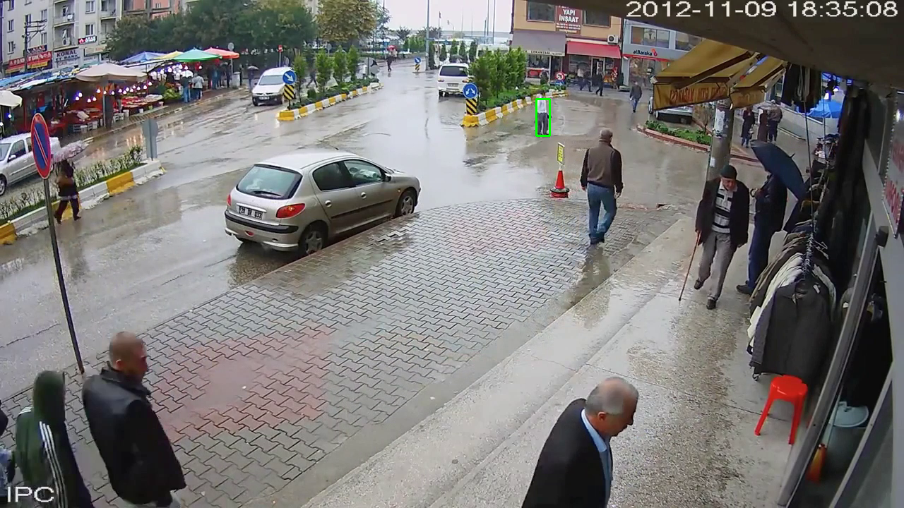
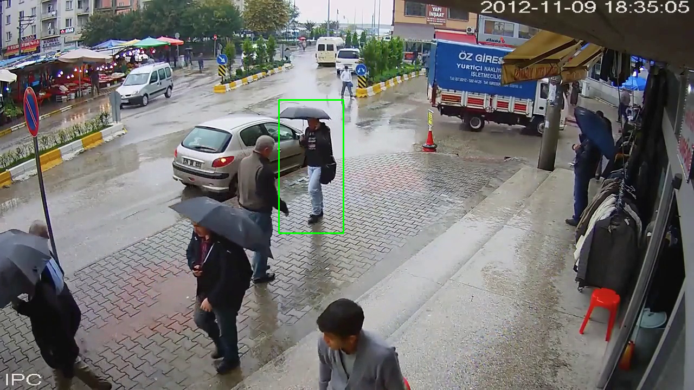
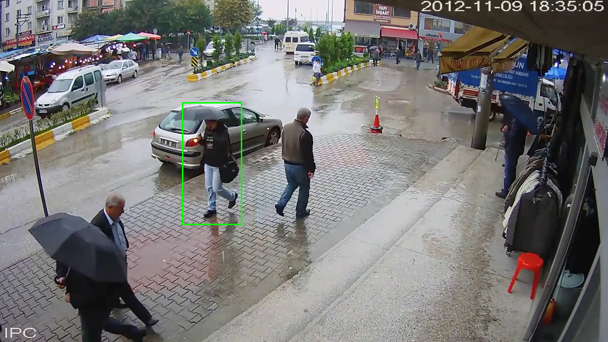

# Object Tracking with OpenCV

This project implements object tracking using OpenCV's CSRT (Discriminative Correlation Filter) tracker. The application allows you to select a Region of Interest (ROI) and track the selected object in a video file.

## Setup Instructions

### Prerequisites

Ensure you have Python 3.x installed. If not, download and install it from [python.org](https://www.python.org/downloads/).

### 1. Create a Virtual Environment

Create a virtual environment to keep your dependencies isolated:

```bash
python3 -m venv venv
```

Activate the virtual environment:

- **On Linux/macOS**:

  ```bash
  source venv/bin/activate
  ```

- **On Windows**:
  ```bash
  venv\Scripts\activate
  ```

### 2. Install Dependencies

Install the necessary Python packages using the following command:

```bash
pip install -r requirements.txt
```

### 3. Run the Project

To run the object tracking script, execute the following command:

```bash
python tracking_test.py
```

Once the video is loaded, you can select a Region of Interest (ROI) by clicking and dragging your mouse over the object you want to track. Press `SPACE` or `ENTER` to confirm the selection, or press `C` to cancel.

## Project Workflow

1. The application will display the video and ask you to select a Region of Interest (ROI) for tracking.
2. The object tracker will initialize with the selected ROI.
3. The video will continue to play, and the object will be tracked in each frame.
4. If the tracking fails, a failure message will be displayed on the screen.

## Example Images

Here are some example images of how the project works:

### Example 1: Selecting the ROI



### Example 2: Object Tracking in Progress



### Example 3: Object Tracking in Progress



## Troubleshooting

- **Session management error**: This error is related to the graphical interface used by OpenCV. If you're running this script on a headless environment or server, try using OpenCV's headless version (`opencv-python-headless`) or run it in a GUI-enabled environment.
- **Module Not Found Errors**: Ensure you have installed the required dependencies correctly. If you encounter errors related to OpenCV, reinstall it with `pip install opencv-python` or `pip install opencv-contrib-python`.

## Contributing

If you would like to contribute to the project, follow these steps:

1. Fork the repository.
2. Create a new branch for your feature (`git checkout -b feature-name`).
3. Make your changes and commit them (`git commit -am 'Add new feature'`).
4. Push to your fork (`git push origin feature-name`).
5. Open a pull request.

## License

This project is licensed under the XYZ License - see the [LICENSE](./LICENSE) file for details.

### Breakdown of the Sections:

- **Project Description**: Explains what the project does (object tracking using OpenCV).
- **Setup Instructions**: Step-by-step guide on how to set up the project environment and run the script.
- **Project Workflow**: Describes the main steps of the application when running.
- **Example Images**: Links to example images of the project, like ROI selection and tracking in progress.
- **Troubleshooting**: Addresses some common issues you may encounter while running the project.
- **Contributing**: Instructions for others to contribute to the project.
- **License**: Placeholder for your project's license (you can replace "XYZ License" with the actual license you're using).

### Adding Images to the Project

Don't forget to add the example images to the `images` folder in the root of your project directory:

1. Create the `images` directory:

   ```bash
   mkdir images
   ```

2. Place your example images (`example1.png`, `example2.png`, etc.) inside this folder.

### Final Step

Once you’ve created the `README.md`, add it to Git and push it to the repository:

```bash
git add README.md images/
git commit -m "Add README with setup instructions and example images"
git push origin main
```